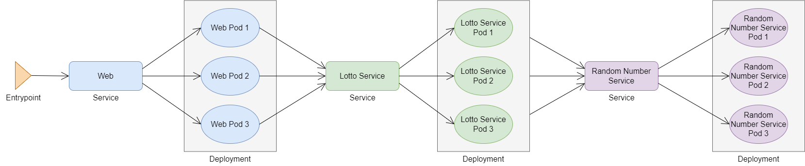

# Lösung Challenge 04 - Applikation über Services veröffentlichen

## 1. Services erstellen

- Service für *RandomNumberService* Deployment

    Bash/PowerShell:
    ```bash
    kubectl expose deployment random-number-service --port=80 --target-port=5000 --name=random-number-service -n lotto
    ```

- Service für *LottoService* Deployment

    Bash/PowerShell:
    ```bash
    kubectl expose deployment lotto-service --port=80 --target-port=5000 --name=lotto-service -n lotto
    ```

- Service für *Web* Deployment

    Bash/PowerShell:
    ```bash
    kubectl expose deployment lotto-web --port=80 --target-port=5000 --name=lotto-web -n lotto
    ```

- Check the services

    Bash/PowerShell:
    ```bash
    kubectl get services -n lotto
    ```

## 2. Port-Forwarding

- Test den Dienst mittels Port-Forwarding

    Bash/PowerShell:
    ```bash
    kubectl port-forward service/lotto-web 8123:80 -n lotto
    ```

- Öffne die URL *[http://localhost:8123](http://localhost:8123)* mit dem Browser

## 3. Deployment konfiguration anpassen

Momentan sind nur Container gestartet. Damit die komplette Application funktioniert, müssen die einzelnen Applikation Bestandteile so konfiguriert werden, dass sie miteinder reden können. Deshalb wurden die Services erstellt.

Services übernehmen ein Loadbalancing innerhalb des Kubernetes Cluster, so dass eine Kommunikation über die Kubernetes Services zu den einzelnen Containern hergestellt werden kann.



### 3.1. Random Number Service Url in Lotto Service setzen

- Über die Environment Variable `RandomNumberService__Url` wird die Verbindung zum Random Number Service hergestellt
- Deployment Konfiguration editieren

    Bash/PowerShell:
    ```bash
    kubectl edit deployment lotto-service -n lotto
    ```

- In der Konfiguration den Punkt `image: <acrname>.azurecr.io/daniellindemann/lotto-lottoservice:1.0.0` suchen
- darunter die Environment Variablen konfiguration anlegen

    ```yaml
    env:
    - name: RandomNumberService__Url
      value: "http://random-number-service"
    ```

- die Konfiguration sollte so aussehen (nur dein Image Name ist ein anderer)

    ```yaml
    containers:
    - image: acrabtisworkshop32258.azurecr.io/daniellindemann/lotto-lottoservice:1.0.0
      imagePullPolicy: IfNotPresent
      name: lotto-lottoservice
      env:
      - name: RandomNumberService__Url
        value: "http://random-number-service"
    ```

### 3.2. Lotto Service Url in Web setzen

- Über die Environment Variable `LottoService__Url` wird die Verbindung zum Lotto Service hergestellt
- Deployment Konfiguration editieren

    Bash/PowerShell:
    ```bash
    kubectl edit deployment lotto-web -n lotto
    ```

- In der Konfiguration den Punkt `image: <acrname>.azurecr.io/daniellindemann/lotto-web:1.0.0` suchen
- darunter die Environment Variablen konfiguration anlegen

    ```yaml
    env:
    - name: LottoService__Url
      value: "http://lotto-service"
    ```

- die Konfiguration sollte so aussehen (nur dein Image Name ist ein anderer)

    ```yaml
    containers:
    - image: acrabtisworkshop32258.azurecr.io/daniellindemann/lotto-web:1.0.0
      imagePullPolicy: IfNotPresent
      name: lotto-web
      env:
      - name: LottoService__Url
        value: "http://lotto-service"
      - name: LottoService__UseLottoServiceCallViaBackend
        value: "true"
    ```

### 3.3. App prüfen

- Erstelle ein Port-forward für den `lotto-web` service

    Bash/PowerShell:
    ```bash
    kubectl port-forward service/lotto-web 8123:80 -n lotto
    ```

- Öffne die die Url *[http://localhost:8123](http://localhost:8123)* im Browser und navigiere zu *Lotto*. Eine Lottozahl wird generiert.

## 4. Public IP für *LottoWeb* Service

- Ändere den Service `Type` von `ClusterIP` zu `LoadBalancer`
    - Editiere die Service Konfiguration

        Bash/PowerShell:
        ```bash
        kubectl edit service lotto-web -n lotto
        ```

    - Suche nach der Zeile

        ```yaml
        type: ClusterIP
        ```

    - Ersetze die Zeile durch

        ```yaml
        type: LoadBalancer
        ```

- Warte bis der Dienst eine Public IP (External IP) erhalten hat

    Bash:
    ```bash
    kubectl get svc -n lotto --watch
    # alternativ
    watch kubectl get svc -n lotto
    ```

    PowerShell:
    ```powershell
    kubectl get svc -n lotto --watch
    # alternativ
    while (1) {kubectl get svc -n lotto; sleep 5}
    ```

- Öffne die IP mit deinem Browser: <http://the-ip-address/>

## 5. nginx Ingress

- Konzept: https://kubernetes.io/docs/concepts/services-networking/ingress/

> ⚠️ Bevor der Ingress installiert werden kann, muss der *LottoWeb* Service wieder auf `ClusterIP` umgestellt werden.

### 5.1 Installiere nginx mit `helm`

- nginx-ingress repo herunterladen

    ```
    helm repo add ingress-nginx https://kubernetes.github.io/ingress-nginx
    helm repo update
    ```

- Namespace erstellen

    Bash:
    ```bash
    INGRESS_NAMESPACE=ingress-nginx
    kubectl create namespace $INGRESS_NAMESPACE
    ```

    PowerShell:
    ```powershell
    $INGRESS_NAMESPACE="ingress-nginx"
    kubectl create namespace $INGRESS_NAMESPACE
    ```

- Ingress Controller installieren

    Bash:
    ```bash
    helm install nginx-ingress ingress-nginx/ingress-nginx \
        --namespace $INGRESS_NAMESPACE \
        --set controller.replicaCount=2 \
        --set controller.service.annotations."service\.beta\.kubernetes\.io/azure-load-balancer-health-probe-request-path"=/healthz
    ```

    PowerShell:
    ```powershell
    helm install nginx-ingress ingress-nginx/ingress-nginx `
        --namespace $INGRESS_NAMESPACE `
        --set controller.replicaCount=2 `
        --set controller.service.annotations."service\.beta\.kubernetes\.io/azure-load-balancer-health-probe-request-path"=/healthz
    ```

- Check installation

    Bash/PowerShell:
    ```bash
    kubectl get pods,services --namespace ingress-nginx
    ```

- Get public ip of ingress

    Bash:
    ```bash
    kubectl get services \
        nginx-ingress-ingress-nginx-controller \
        --namespace ingress-nginx \
        --output jsonpath='{.status.loadBalancer.ingress[0].ip}'
    ```

    PowerShell:
    ```powershell
    kubectl get services `
        nginx-ingress-ingress-nginx-controller `
        --namespace ingress-nginx `
        --output jsonpath='{.status.loadBalancer.ingress[0].ip}'
    ```

### 5.2 Ingress konfigurieren

Die Applikation wird über den Dienst nip.io verfügbar gemacht. Die URL lautet `frontend.< ingress ip adresse >.nip.io`.

- Erstelle eine yaml Datei mit dem Namen `ingress-lotto-web.yaml`, konfiguriere den Ingress entsprechend und speichere die Datei ab. Ersetze `< ingress ip adresse >` mit der Ingress IP Adresse

    ```yaml
    apiVersion: networking.k8s.io/v1
    kind: Ingress
    metadata:
      name: ingress-lotto-web
      labels:
        app: lotto-web
    spec:
      ingressClassName: nginx
      rules:
      - host: "frontend.< ingress ip adresse >.nip.io"
        http:
          paths:
          - pathType: Prefix
            path: "/"
            backend:
              service:
               name: lotto-web
               port:
                 number: 80
    ```

- Stelle die yaml Konfiguration in Kubernetes bereit

    Bash/PowerShell
    ```bash
    kubectl apply -f ingress-lotto-web.yaml -n lotto
    ```

- Greife auf die URL `frontend.< ingress ip adresse >.nip.io` zu
